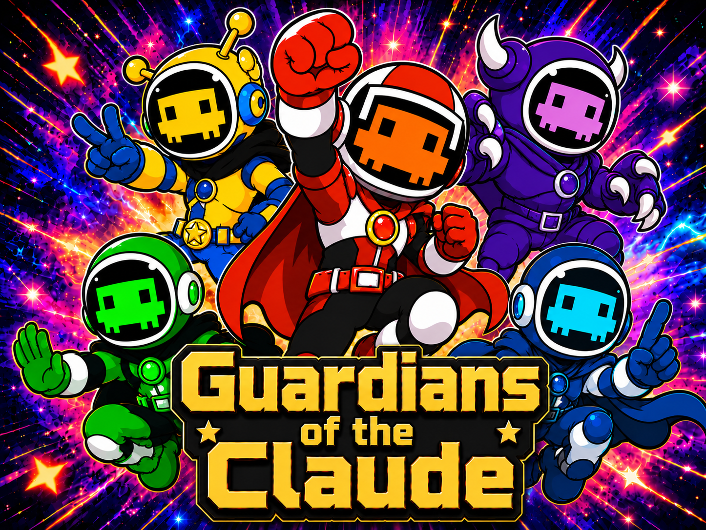

<p align="center">
  
</p>

<p align="center">
  
  <a href="LICENSE"></a>
  
  
</p>

> ⚠️ **v3.0.0 (2026-05-23)** — Breaking change: `bash` is now required (Git Bash on Windows or WSL). PowerShell `.ps1` companions and ko-KR / ja-JP localizations removed. [Migration guide →](CHANGELOG.md#300---2026-05-23)

A meta-system for Claude Code configuration. Start with a 2-minute guided setup, then grow into audit, security hardening, and optimization workflows as your project evolves. Same tool, continuous reinforcement.

**For beginners:** 2-minute setup — Claude asks a few questions and generates all configuration files for you.

**For power users:** 4 chained skills (`/create` → `/audit` → `/secure`/`/optimize`) backed by cross-skill memory, profile drift detection, and a decision journal.

## Requirements

Guardians-of-the-Claude requires `bash` to run its hook scripts (SessionStart) and CI tooling.

| Platform | bash provider |
|---|---|
| **Linux** | Native (`bash` ships with all distros) |
| **macOS** | Native (`bash 3.2+` preinstalled, or Homebrew `bash 5+`) |
| **Windows** | [Git for Windows](https://git-scm.com/download/win) (provides Git Bash) **or** WSL |

`jq` is also required for SessionStart hook JSON parsing. **It is NOT bundled with Git for Windows** — install separately via `winget install jqlang.jq`, [download from jqlang.org](https://jqlang.org/download/), or use a package manager (Scoop: `scoop install jq`; Chocolatey: `choco install jq`). Linux/macOS: available via every major package manager (`apt`, `brew`, etc.).

> **Migrating from v2.x?** v3.0.0 retired the `.ps1` companion scripts and made `bash` a hard requirement (Git Bash on Windows or WSL) — see [CHANGELOG v3.0.0](CHANGELOG.md#300---2026-05-23) for the full migration path.

## Philosophy

1. **Verify, don't trust** — Include test, lint, and build commands so Claude checks its own work. This is the single highest-leverage configuration you can make.
2. **Less is more** — Shorter instructions produce better adherence. Each guide stays short enough to read in one sitting.
3. **Specific over vague** — `npm test` not "make sure it works." Every command must be copy-pasteable.
4. **Continuous reinforcement** — Day 1 is a 2-minute setup. Day 7 adds audit and hardening. Day 14 is when cross-skill memory and automated drift detection come into their own. The tool grows with you — you never pay for complexity you don't need.

## Trust Model

This plugin generates configuration files and runs one Claude Code hook (`SessionStart`) with your full shell privileges — same as any other Claude Code plugin. The hook reads project state files (e.g., `profile.json`, `recommendations.json`) and emits a short digest if attention is needed; it does not modify your project. The plugin also does **not** call external LLMs, send telemetry, or write outside your project (`.claude/`, `CLAUDE.md`) and the plugin cache (`.claude/.plugin-cache/<plugin>/local/`). Skills are markdown instructions Claude Code reads — there is no separate runtime executing on your machine.

For vulnerability reports, see [SECURITY.md](docs/SECURITY.md). For per-skill privilege scope, see each `plugin/skills/<name>/SKILL.md`.

## Day 1 — 2-Minute Quickstart

> **Prerequisites:** Claude Code installed (`claude --version`), plus `bash` and `jq`. See the [Requirements](#requirements) section below for platform-specific install guidance.

1. **Add the marketplace and install the plugin** in Claude Code:

   ```text
   claude
   > /plugin marketplace add wlsgur073/Guardians-of-the-Claude
   > /plugin install guardians-of-the-claude@guardians
   > /reload-plugins
   ```

2. **Run the setup command** in your project:

   ```text
   cd your-project
   claude
   > /guardians-of-the-claude:create
   ```

   **Alternative methods** (without installing the plugin):

   | Method | Command |
   | ------ | ------- |
   | Local plugin | `claude --plugin-dir /path/to/Guardians-of-the-Claude/plugin` |
   | `@` import | `@../Guardians-of-the-Claude/plugin/skills/create/SKILL.md` |
   | Direct paste | Copy the contents of `plugin/skills/create/SKILL.md` and paste directly into the conversation |

3. **Choose your path** — Claude detects your project state and asks what to do:

   | Path | When | What happens |
   | ---- | ---- | ------------ |
   | **New project** | No code yet | 4 quick questions → `CLAUDE.md` (7 sections) + `.claude/settings.json` |
   | **Existing project** | Code exists, no Claude config | 6 questions with auto-detected defaults → full config (CLAUDE.md + settings + rules + optional hooks/agents/skills) |
   | **Add missing features** | Config already exists | Scans current setup, shows what's configured vs missing, lets you add only what you need |

   > **Already have a config?** Claude auto-detects it and offers to add missing features without re-answering questions you've already covered.
   > **Picked the wrong path?** No worries — Claude detects mismatches and suggests switching automatically.

4. **Done** — Claude generates all configuration files and prints a summary table.
   Run `/memory` to verify everything loaded correctly.

5. **Next step (optional)** — Install the `claude-code-setup` plugin to get
   tailored recommendations for MCP servers, hooks, and skills based on your stack.

> **Tip:** Run `/init` in your project first — Claude auto-generates a starter
> CLAUDE.md. Then run `/guardians-of-the-claude:create` choosing "Existing project"
> to fill gaps `/init` misses.

**You can stop here.** The configuration works on its own. The Day 7 and Day 14+ sections below describe what happens next if you want more.

## Day 7 — Audit, Harden, Optimize

After your project has real code and real usage, three more skills help you maintain configuration health:

| Skill | When to run | What it does |
| ----- | ----------- | ------------ |
| `/guardians-of-the-claude:audit` | After significant project changes | Scores your current Claude Code config (0-100), identifies drift, recommends next steps |
| `/guardians-of-the-claude:secure` | After audit finds security gaps | Adds deny patterns, security rules, file protection hooks |
| `/guardians-of-the-claude:optimize` | After audit finds quality gaps | Splits bloated CLAUDE.md into rules/, adds agent diversity, MCP recommendations |

**Typical flow:** `/create` → (weeks of development) → `/audit` → `/secure` or `/optimize` → `/audit` to re-verify.

## Day 14+ — Meta-System Engagement

Over multiple skill runs, the plugin's **meta-system layer** fills out — persistent learning that adapts to your project over time:

- **Project profile** — Auto-detected tech stack, structure, and configuration state (`profile.json`, with `state-summary.md` as the human-readable view)
- **Decision journal** — Every skill run appends to a compacted changelog so context is preserved across sessions (`config-changelog.md`)
- **Cross-skill memory** — `/optimize` knows what `/secure` already did; `/audit` knows what was previously declined
- **Profile drift detection** — If your project switches package managers or upgrades a framework major version, the plugin notices and re-evaluates recommendations
- **Stagnation awareness** — If the same recommendation is ignored 3 times, the plugin asks whether to mark it as declined

**You never need to read about this to use the plugin.** It runs automatically. See [learning-system.md](plugin/references/learning-system.md) if you want to understand the internals.

## v2.11+ State Format & Stateless Mode

**v2.11 migration** (for users upgrading from v2.10.x): state format moved from Markdown files to JSON. First skill run after upgrade auto-converts `local/project-profile.md` + `local/latest-*.md` into `local/profile.json` + `local/recommendations.json`, preserving originals under `local/legacy-backup/<ISO-8601-UTC>/`. Forward-only — rollback requires manual restoration plus pinning v2.10.x. See [CHANGELOG.md](CHANGELOG.md) v2.11.0 entry for parse-failure recovery and full migration details.

**Stateless mode** (since v2.12.0): when `local/` cannot be written (read-only mount, privacy-sensitive project, user-disabled), the skill prints a one-time warning and skips all state file writes — learning does not persist across sessions. Privacy-sensitive projects can rely on stateless mode rather than pinning an old version.

**Report migration failures** at [GitHub Issues](https://github.com/wlsgur073/Guardians-of-the-Claude/issues) with the warning output and (if possible) a redacted snippet of the file that failed to parse. No telemetry is collected automatically.

## CI smoke lane

The CI smoke lane (`ci/fixtures/` + `ci/golden/`) validates a broad fixture set — the skill-flow, drift-state, state-lock concurrency, `audit_run_id`, and SessionStart hook-parity lanes — against frozen golden snapshots on pull requests that touch the plugin, template, or CI paths and on every version tag. The separate skill-output quality evaluation (the gitignored `test/` framework) remains maintainer-local.

## What's Inside

```text
Guardians-of-the-Claude/
├── .claude-plugin/          ← Marketplace manifest (makes this repo a plugin marketplace)
├── plugin/                  ← Plugin package
│   ├── .claude-plugin/
│   │   └── plugin.json
│   ├── hooks/
│   │   ├── hooks.json       ← SessionStart hook (bash entry)
│   │   └── session-start.sh ← bash state check (Linux/macOS/Git Bash/WSL)
│   ├── references/
│   │   ├── security-patterns.md  ← Shared security templates (used by /create and /secure)
│   │   └── learning-system.md   ← Shared learning system reference (used by all skills)
│   └── skills/
│       ├── create/
│       │   ├── SKILL.md     ← Create skill (/guardians-of-the-claude:create)
│       │   ├── references/  ← Generation best practices
│       │   └── templates/   ← Starter & Advanced path instructions
│       ├── audit/
│       │   ├── SKILL.md     ← Audit skill (/guardians-of-the-claude:audit)
│       │   └── references/  ← Scoring model and formulas
│       ├── secure/
│       │   └── SKILL.md     ← Secure skill (/guardians-of-the-claude:secure)
│       └── optimize/
│           └── SKILL.md     ← Optimize skill (/guardians-of-the-claude:optimize)
├── templates/starter/       ← Filled starter example (fictional "TaskFlow" project)
├── templates/advanced/      ← Filled advanced example (rules, hooks, agents, skills)
├── docs/
│   ├── guides/              ← Guides explaining each concept
│   └── *.md                 ← Community health files and project roadmap
└── CHANGELOG.md             ← Version history (Keep a Changelog format)
```

## How Claude Code Memory Works

Claude Code uses a layered memory system: CLAUDE.md (your instructions), `.claude/rules/` (modular rule files), auto memory (Claude's own notes), and plugin cache (plugin-managed state). See the [Directory Structure Guide](docs/guides/directory-structure-guide.md) for details.

> **The #1 Rule:** Give Claude a way to verify its work — include test commands,
> lint commands, and build commands in your CLAUDE.md. This is the single
> highest-leverage thing you can do.

## Docs

Start here, then follow the path that matches your level:

| Step | Guide | Who needs it |
| ---- | ----- | ------------ |
| 1 | [Getting Started](docs/guides/getting-started.md) | Everyone — setup walkthrough |
| 2 | [CLAUDE.md Guide](docs/guides/claude-md-guide.md) | Everyone — writing effective instructions |
| 3 | [Settings Guide](docs/guides/settings-guide.md) | Everyone — permissions and preferences |
| 4 | [Rules Guide](docs/guides/rules-guide.md) | When CLAUDE.md exceeds ~200 lines |
| 5 | [Directory Structure](docs/guides/directory-structure-guide.md) | When you want to understand `.claude/` |
| 6 | [Effective Usage](docs/guides/effective-usage-guide.md) | After your first day with Claude Code |
| 7 | [Advanced Features](docs/guides/advanced-features-guide.md) | When you need hooks, agents, or skills |
| 8 | [MCP Integration](docs/guides/mcp-guide.md) | When you want to connect external tools |
| 9 | [Recommended Plugins](docs/guides/recommended-plugins-guide.md) | When you want to extend Claude Code |

## Recommended Plugins

Claude Code supports both official (Anthropic-maintained) and community plugins that extend its capabilities — from full dev workflows to code intelligence. See the **[Recommended Plugins Guide](docs/guides/recommended-plugins-guide.md)** for the full curated list organized by category.

Browse available plugins with `/plugin` in Claude Code, or see [Plugin docs](https://code.claude.com/docs/en/discover-plugins) for details.

## Contributing

Contributing? In this repo? Just tell Claude to do it.
...Fine, humans are welcome too. Open an issue or PR.
See [ROADMAP.md](docs/ROADMAP.md) for the project direction and how to propose changes via [GitHub Discussions](https://github.com/wlsgur073/Guardians-of-the-Claude/discussions).

## License

MIT — see [LICENSE](LICENSE).
