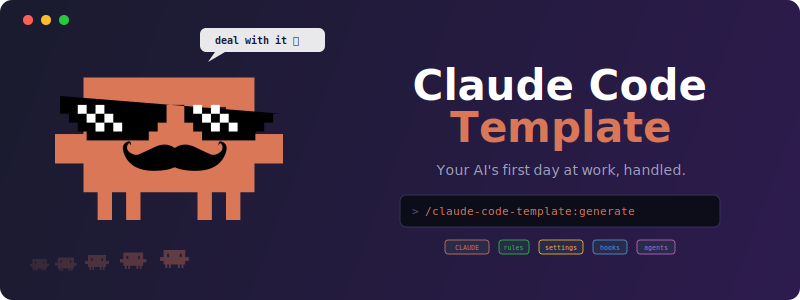

<p align="center">
  
</p>

Claude Code 설정을 위한 스타터 템플릿과 가이드. 플러그인을 설치하고
`/claude-code-template:create`을 실행하면, Claude가 대화형 인터뷰를 통해
모든 설정 파일을 자동 생성합니다.

**대상:** 첫날부터 바로 쓸 수 있는 설정을 원하는 Claude Code 입문 개발자.

## 철학

1. **신뢰보다 검증** — 테스트, 린트, 빌드 명령어를 포함해서 Claude가 스스로 작업을 검증하게 하세요. 가장 효과적인 설정입니다.
2. **짧을수록 좋다** — 짧은 지시사항일수록 Claude가 더 잘 따릅니다. 각 가이드는 한 번에 읽을 수 있는 분량을 유지합니다.
3. **구체적으로** — "잘 작동하는지 확인"이 아니라 `npm test`. 모든 명령어는 복사해서 바로 실행할 수 있어야 합니다.
4. **단순하게 시작, 필요할 때 확장** — 두 개 파일로 시작합니다. Rules, hooks, agents, skills는 실제로 필요할 때 추가하세요.

## 빠른 시작

1. **마켓플레이스를 추가하고 플러그인을 설치**합니다:

   ```text
   claude
   > /plugin marketplace add wlsgur073/Claude-Code-Template
   > /plugin install claude-code-template@wlsgur073-plugins
   ```

2. **프로젝트에서 설정 커맨드를 실행**하세요:

   ```text
   cd your-project
   claude
   > /claude-code-template:create
   ```

   **대체 방법** (플러그인 설치 없이):

   | 방법 | 명령어 |
   | ---- | ------ |
   | 로컬 플러그인 | `claude --plugin-dir /path/to/Claude-Code-Template/plugin` |
   | `@` import | `@../Claude-Code-Template/plugin/skills/create/SKILL.md` |
   | 직접 붙여넣기 | `plugin/skills/create/SKILL.md`의 내용을 복사하여 대화에 직접 붙여넣기 |

3. **경로를 선택**하세요 — Claude가 새 프로젝트인지 기존 프로젝트인지 물어봅니다:

   | 경로 | 시기 | 동작 |
   | ---- | ---- | ---- |
   | **새 프로젝트** | 코드 없음 | 4개 질문 → `CLAUDE.md` (6섹션) + `.claude/settings.json` |
   | **기존 프로젝트** | 코드 있음, Claude 설정 없음 | 6개 질문 (자동 감지 기본값) → 전체 설정 (CLAUDE.md + settings + rules + 선택적 hooks/agents/skills) |
   | **부족한 기능 추가** | 설정이 이미 존재 | 현재 설정을 스캔하고, 설정된 항목과 누락된 항목을 보여준 뒤, 필요한 것만 추가 |

   > **이미 설정이 있나요?** Claude가 자동으로 감지하여 이미 답한 질문을 건너뛰고 부족한 기능만 추가할 수 있도록 안내합니다.
   > **잘못 선택했나요?** 걱정 마세요 — Claude가 불일치를 감지하고 자동으로 경로 전환을 제안합니다.

4. **완료** — Claude가 모든 설정 파일을 생성하고 요약 테이블을 출력합니다.
   `/memory`를 실행하여 모든 파일이 정상 로드되었는지 확인하세요.

5. **다음 단계 (선택)** — `claude-code-setup` 플러그인을 설치하면 프로젝트 스택에
   맞는 MCP 서버, hooks, skills를 추천받을 수 있습니다.

> **팁:** 프로젝트에서 먼저 `/init`을 실행하세요 — Claude가 기본 CLAUDE.md를
> 자동 생성합니다. 이후 `/claude-code-template:create`에서 "기존 프로젝트"를
> 선택하면 `/init`이 놓친 부분을 채울 수 있습니다.

## 템플릿 구조

```text
Claude-Code-Template/
├── .claude-plugin/          ← 마켓플레이스 매니페스트 (플러그인 마켓플레이스)
├── plugin/                  ← 플러그인 패키지
│   ├── .claude-plugin/
│   │   └── plugin.json
│   ├── hooks/
│   │   ├── hooks.json       ← SessionStart 훅
│   │   └── session-start.sh
│   ├── references/
│   │   └── security-patterns.md  ← 공유 보안 템플릿 (/create, /secure 공용)
│   └── skills/
│       ├── create/
│       │   ├── SKILL.md     ← 생성 스킬 (/claude-code-template:create)
│       │   ├── references/  ← 생성 모범 사례
│       │   └── templates/   ← Starter & Advanced 경로 지침
│       ├── audit/
│       │   ├── SKILL.md     ← 감사 스킬 (/claude-code-template:audit)
│       │   └── references/  ← 스코어링 모델 및 산출 공식
│       ├── secure/
│       │   └── SKILL.md     ← ���안 강화 스킬 (/claude-code-template:secure)
│       ├── optimize/
│       │   └── SKILL.md     ← 최적화 스킬 (/claude-code-template:optimize)
│       └── generate/
│           └── SKILL.md     ← 지원 중단 — /create로 리다이렉트
├── templates/starter/       ← 스타터 실전 예시 (가상 "TaskFlow" 프로젝트)
├── templates/advanced/      ← 고급 기능 실전 예시 (rules, hooks, agents, skills)
├── docs/
│   ├── guides/              ← 가이드
│   ├── i18n/ko-KR/          ← 한국어 번역 (가이드, 템플릿)
│   ├── plans/               ← 설계 및 계획 문서
│   └── *.md                 ← 커뮤니티 문서 및 프로젝트 로드맵
└── CHANGELOG.md             ← 버전 이력 (Keep a Changelog 형식)
```

| 디렉토리 | 용도 |
| ------------- | --------- |
| `templates/starter/` | 스타터 실전 예시 — 최소 TaskFlow 설정 |
| `templates/advanced/` | 고급 실전 예시 — rules, hooks, agents, skills |
| `docs/guides/` | 독립 가이드 — 각각 따로 읽을 수 있음 |
| `docs/i18n/ko-KR/` | 한국어 번역 (가이드, 템플릿) |
| `docs/plans/` | 설계 및 계획 문서 |
| `docs/*.md` | 커뮤니티 문서 및 프로젝트 [로드맵](../../ROADMAP.md) |

## Claude Code 메모리 작동 방식

Claude Code는 계층형 메모리 시스템으로 동작합니다: CLAUDE.md (사용자의 지시사항), `.claude/rules/` (모듈형 규칙 파일), 자동 메모리 (Claude가 직접 작성하는 메모), 플러그인 캐시 (플러그인이 관리하는 상태). 자세한 내용은 [디렉토리 구조 가이드](guides/directory-structure-guide.md)를 참고하세요.

> **가장 중요한 원칙:** Claude가 자기 작업을 스스로 검증할 수 있게 하세요 —
> CLAUDE.md에 테스트, 린트, 빌드 명령어를 포함하세요.
> 이것 하나만으로 결과물의 품질이 크게 달라집니다.

## 문서

시작 후, 자신의 수준에 맞는 순서를 따르세요:

| 단계 | 가이드 | 필요한 사람 |
| ---- | ----- | ---------- |
| 1 | [시작하기](guides/getting-started.md) | 모든 사용자 — 설정 안내 |
| 2 | [CLAUDE.md 가이드](guides/claude-md-guide.md) | 모든 사용자 — 효과적인 지시 작성법 |
| 3 | [설정 가이드](guides/settings-guide.md) | 모든 사용자 — 권한 및 환경설정 |
| 4 | [규칙 가이드](guides/rules-guide.md) | CLAUDE.md가 ~100줄을 초과할 때 |
| 5 | [디렉토리 구조](guides/directory-structure-guide.md) | `.claude/` 구조를 이해하고 싶을 때 |
| 6 | [효과적인 사용법](guides/effective-usage-guide.md) | Claude Code를 하루 사용한 후 |
| 7 | [고급 기능](guides/advanced-features-guide.md) | 훅, 에이전트, 스킬이 필요할 때 |
| 8 | [MCP 연동](guides/mcp-guide.md) | 외부 도구를 연결하고 싶을 때 |

## 추천 플러그인

Claude Code는 기능을 확장하는 공식 플러그인을 지원합니다.
Claude Code에서 `/plugin`으로 탐색하거나, [플러그인 문서](https://code.claude.com/docs/en/discover-plugins)를 참고하세요.

### 개발 워크플로우 추천

| 플러그인 | 설명 |
| ------ | ------------ |
| [superpowers](https://github.com/obra/superpowers) | 전체 개발 워크플로우 — 스펙 → 설계 → 계획 → 서브에이전트 기반 구현. Claude가 계획에서 벗어나지 않고 자율 작업 |
| [feature-dev](https://github.com/anthropics/claude-plugins-official/tree/main/plugins/feature-dev) | 구조화된 7단계 기능 개발: 코드베이스 탐색 → 질문 → 설계 → 구현 → 리뷰 |
| [code-review](https://github.com/anthropics/claude-plugins-official/tree/main/plugins/code-review) | 멀티 에이전트 PR 리뷰. 신뢰도 기반 스코어링으로 오탐 필터링 |
| [code-simplifier](https://github.com/anthropics/claude-plugins-official/tree/main/plugins/code-simplifier) | 최근 수정된 코드를 명확하고 일관되게 리팩터링. 기존 동작은 그대로 유지 |

### 코드 인텔리전스 & 품질

| 플러그인 | 설명 |
| ------ | ------------ |
| [typescript-lsp](https://github.com/anthropics/claude-plugins-official/tree/main/plugins/typescript-lsp) | TypeScript/JS 언어 서버 — 정의로 이동, 참조 찾기, 에러 체크를 Claude 안에서 바로 |
| [security-guidance](https://github.com/anthropics/claude-plugins-official/tree/main/plugins/security-guidance) | 코드 작성 전 보안 취약점(XSS, 인젝션 등)을 경고하는 Pre-edit 훅 |
| [context7](https://github.com/upstash/context7) | 최신 라이브러리 문서를 즉시 가져오는 MCP 서버. API 할루시네이션 방지 |

### UI & 브라우저

| 플러그인 | 설명 |
| ------ | ------------ |
| [frontend-design](https://github.com/anthropics/claude-plugins-official/tree/main/plugins/frontend-design) | "AI가 만든 것 같지 않은" 독특하고 프로덕션 수준의 UI 생성 |
| [chrome-devtools-mcp](https://github.com/ChromeDevTools/chrome-devtools-mcp) | 실시간 Chrome 브라우저 제어 및 검사 — 디버깅, 자동화, 성능 분석 |
| [figma](https://github.com/figma/mcp-server-guide) | Figma 디자인 파일에서 컨텍스트를 직접 가져와 구현에 활용 |

### 프로젝트 셋업

| 플러그인 | 설명 |
| ------ | ------------ |
| [claude-code-setup](https://github.com/anthropics/claude-plugins-official/tree/main/plugins/claude-code-setup) | 코드베이스를 스캔하고 프로젝트에 최적화된 hooks, skills, MCP 서버, 서브에이전트를 추천 |
| [claude-md-management](https://github.com/anthropics/claude-plugins-official/tree/main/plugins/claude-md-management) | CLAUDE.md 품질 감사 + `/revise-claude-md`로 세션 학습 내용 반영 |

## 상태 표시줄 (Statusline)

Claude Code 하단 상태 표시줄을 커스터마이즈하여 모델, 컨텍스트 사용량, 비용, 소요 시간, git 브랜치를 한눈에 볼 수 있습니다:

```text
[Opus 4.6 (1M context)] 📁 my-project
 🌿 feature/auth | ████████░░ 80% | $1.25 | ⏱️ 3m 42s
```

**한 줄 설정:**

```bash
cp Claude-Code-Template/statusline.sh ~/.claude/statusline.sh
```

Claude Code가 `~/.claude/statusline.sh`를 자동으로 감지합니다 — 추가 설정 불필요.

> **필수 조건:** [jq](https://jqlang.org)가 설치되어 있어야 합니다 (`brew install jq` / `apt install jq` / `choco install jq`).

## 참여

참여요? 여기에서요? Claude한테 시키면 되는데.. (피식)
...좋아요, 사람도 환영합니다. 이슈나 PR을 열어주세요.
프로젝트 방향성과 제안은 [ROADMAP.md](../../ROADMAP.md)를 확인하고 [GitHub Discussions](https://github.com/wlsgur073/Claude-Code-Template/discussions)에서 참여하세요.

## 라이선스

MIT — [LICENSE](../../../LICENSE) 참조.
